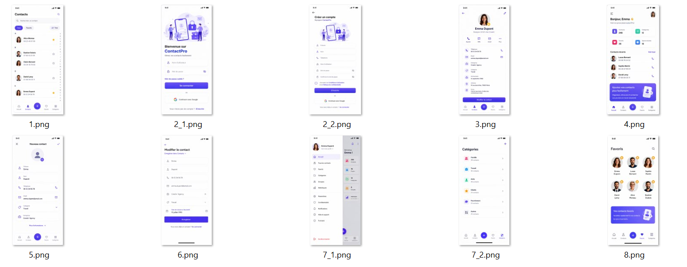

# 📱 Contact Pro

Une application Flutter permettant de gérer une liste de contacts de manière simple et intuitive.

> Projet réalisé dans le cadre des travaux pratiques du cours Flutter.

---

## ✨ Fonctionnalités

- ➕ Ajouter un contact
- 📋 Afficher la liste des contacts
- 🔍 Consulter les informations d'un contact
- ✏️ Modifier un contact
- 🗑️ Supprimer un contact
- 📞 Gestion des informations principales (nom, téléphone, email, etc.)

---

## 📸 Captures d'écran


### Accueil

<p align="center">
  
</p>

---

### Ajouter un contact

<p align="center">
  
</p>

---

### Détails d'un contact

<p align="center">
  
</p>

---

### Modifier un contact

<p align="center">
  
</p>

---

## 📂 Architecture

```
lib/
│
├── models/
├── pages/
├── services/
├── widgets/
└── main.dart
```

---

## 🚀 Installation

Vous pouvez récupérer ce projet de deux façons.

### Option 1 : Cloner le dépôt Git

### 1. Cloner le projet

```bash
git clone https://github.com/dafe24-dev/formation_flutter_p1.git
```

### 2. Accéder au projet

```bash
cd contact_pro
```

### 3. Installer les dépendances

```bash
flutter pub get
```

### 4. Lancer l'application

```bash
flutter run
```

---
### Option 2 : Télécharger le projet au format ZIP

1. Cliquez sur le bouton **Code** en haut de la page GitHub.
2. Sélectionnez **Download ZIP**.
3. Décompressez l'archive sur votre ordinateur.
4. Ouvrez le dossier du projet dans **Visual Studio Code** ou **Android Studio**.
5. Exécutez les commandes suivantes :
<p align="left">
  
</p>

```bash
flutter pub get
flutter run
```

## 🛠️ Technologies utilisées

- Flutter
- Dart
- Material Design

---

## 📚 Objectifs pédagogiques

Ce projet permet de mettre en pratique :

- Navigation entre les pages
- Création d'interfaces Flutter
- Gestion des formulaires
- Manipulation des widgets
- Organisation d'un projet Flutter
- CRUD (Créer, Lire, Modifier et Supprimer)

---

## 👨‍🏫 Auteur

**Dafé Coulibaly**

Formateur Flutter

---

## 📄 Licence

Projet destiné à un usage pédagogique.